# Sunton CYD (Cheap Yellow Display) PlatformIo Board definitions

## This repo contains definitions for the CPU and board information about the hardware

These json files are to be used in cooperation with PlatformIO and contain defines that specify the type, presence and specifics the hardware.
PlatformIO detects automatically these boards when this repository is used as a git submodule in the directory `<project>/boards`.

These defines are used by the LVGL drivers for these boards: [esp32-smartdisplay](https://github.com/rzeldent/esp32-smartdisplay).

## Supported boards

| Type                                    | USB               | CPU                      | Flash | PSRAM | Cores/Speed | Display                               | Size       | Display interface           | Display controller                       | Touch interface | Touch controller                         | Audio                                    | Flash                                         | LED | CdS                                       | Relay | Link                                                                 |
| --------------------------------------- | ---------         | ------------------------ | ----- | ----- | ----------- | ------------------------------------- | ---------- | --------------------------- | ---------------------------------------- | --------------- | ---------------------------------------- | ---------------------------------------- | --------------------------------------------- | --- | ----------------------------------------- | ----- | -------------------------------------------------------------------- |
| [ESP32_1732S019C](#esp32_1732s019-nc)   | USB-C             | ESP32-S3-WROOM-1-MCN16R8 | 16Mb  | 8Mb   | 2 x 240Mhz  | 170x320                               | 1.9"       | SPI                         | [ST7789](assets/datasheets/ST7789.pdf)   | I2C             | [GT911](assets/datasheets/GT911.pdf)     |                                          |                                               |     |                                           |       | [Ali Express](https://www.aliexpress.com/item/1005005059421229.html) |
| [ESP32_1732S019N](#esp32_1732s019-nc)   | USB-C             | ESP32-S3-WROOM-1-MCN16R8 | 16Mb  | 8Mb   | 2 x 240Mhz  | 170x320                               | 1.9"       | SPI                         | [ST7789](assets/datasheets/ST7789.pdf)   |                 |                                          |                                          |                                               |     |                                           |       | [Ali Express](https://www.aliexpress.com/item/1005005059421229.html) |
| [ESP32-2424S012C](#esp32-2424s012-nc)   | USB-C             | ESP32-C3-MINI-1U-XXN4    | 4Mb   |       | 1 x 160Mhz  | 240x240                               | 1.2" round | SPI                         | [GC9A01A](assets/datasheets/GC9A01A.pdf) | I2C             | [CST816S](assets/datasheets/CST816S.pdf) |                                          |                                               |     |                                           |       | [Ali Express](https://www.aliexpress.com/item/1005005453515690.html) |
| [ESP32-2424S012N](#esp32-2424s012-nc)   | USB-C             | ESP32-C3-MINI-1U-XXN4    | 4Mb   |       | 1 x 160Mhz  | 240x240                               | 1.2" round | SPI                         | [GC9A01A](assets/datasheets/GC9A01A.pdf) |                 |                                          |                                          |                                               |     |                                           |       | [Ali Express](https://www.aliexpress.com/item/1005005453515690.html) |
| [ESP32-2432S022C](#esp32-2432s022-nc)   | USB-C             | ESP32-WROOM-32           | 4Mb   |       | 2 x 240Mhz  | 240x320                               | 2.2"       | SPI                         | [ST7789](assets/datasheets/ST7789.pdf)   | I2C             | [CST816S](assets/datasheets/CST816S.pdf) | [FM8002A](assets/datasheets/FM8002A.pdf) |                                               |     |                                           |       | [Ali Express](https://www.aliexpress.com/item/1005006284154750.html) |
| [ESP32-2432S022N](#esp32-2432s022-nc)   | USB-C             | ESP32-WROOM-32           | 4Mb   |       | 2 x 240Mhz  | 240x320                               | 2.2"       | SPI                         | [ST7789](assets/datasheets/ST7789.pdf)   |                 |                                          | [FM8002A](assets/datasheets/FM8002A.pdf) |                                               |     |                                           |       | [Ali Express](https://www.aliexpress.com/item/1005006284154750.html) |
| [ESP32-2432S024N](#esp32-2432s024-nrc)  | micro USB         | ESP32-WROOM-32           | 4Mb   |       | 2 x 240Mhz  | [240x320](assets/lcd/JC2432A024N.pdf) | 2.4"       | SPI                         | [ILI9341](assets/datasheets/ILI9341.pdf) |                 |                                          | [FM8002A](assets/datasheets/FM8002A.pdf) | [W25Q32JV](assets/datasheets/25Q32JVSSIQ.pdf) | RGB | [GT36516](assets/datasheets//GT36516.pdf) |       | [Ali Express](https://www.aliexpress.com/item/1005005865107357.html) |
| [ESP32-2432S024R](#esp32-2432s024-nrc)  | micro USB         | ESP32-WROOM-32           | 4Mb   |       | 2 x 240Mhz  | [240x320](assets/lcd/JC2432A024N.pdf) | 2.4"       | SPI                         | [ILI9341](assets/datasheets/ILI9341.pdf) | SPI             | [XPT2046](assets/datasheets/XPT2046.pdf) | [FM8002A](assets/datasheets/FM8002A.pdf) | [W25Q32JV](assets/datasheets/25Q32JVSSIQ.pdf) | RGB | [GT36516](assets/datasheets//GT36516.pdf) |       | [Ali Express](https://www.aliexpress.com/item/1005005865107357.html) |
| [ESP32-2432S028R](#esp32-2432s028r)     | micro USB         | ESP32-WROOM-32           | 4Mb   |       | 2 x 240Mhz  | [240x320](assets/lcd/JC2432A028N.pdf) | 2.8"       | SPI                         | [ILI9341](assets/datasheets/ILI9341.pdf) | SPI             | [XPT2046](assets/datasheets/XPT2046.pdf) | [FM8002A](assets/datasheets/FM8002A.pdf) | [W25Q32JV](assets/datasheets/25Q32JVSSIQ.pdf) | RGB | [GT36516](assets/datasheets//GT36516.pdf) |       | [Ali Express](https://www.aliexpress.com/item/1005004502250619.html) |
| [ESP32-2432S028Rv2](#esp32-2432s028r)   | USB-C             | ESP32-WROOM-32           | 4Mb   |       | 2 x 240Mhz  | [240x320](assets/lcd/JC2432B028N.pdf) | 2.8"       | SPI                         | [ILI9341](assets/datasheets/ILI9341.pdf) | SPI             | [XPT2046](assets/datasheets/XPT2046.pdf) | [FM8002A](assets/datasheets/FM8002A.pdf) | [W25Q32JV](assets/datasheets/25Q32JVSSIQ.pdf) | RGB | [GT36516](assets/datasheets//GT36516.pdf) |       | [Ali Express](https://www.aliexpress.com/item/1005004502250619.html) |
| [ESP32-2432S028Rv3](#esp32-2432s028r)   | USB-C + micro USB | ESP32-WROOM-32           | 4Mb   |       | 2 x 240Mhz  | [240x320](assets/lcd/JC2432B028N.pdf) | 2.8"       | SPI                         | [ST7789](assets/datasheets/ST7789.pdf)   | SPI             | [XPT2046](assets/datasheets/XPT2046.pdf) | [FM8002A](assets/datasheets/FM8002A.pdf) | [W25Q32JV](assets/datasheets/25Q32JVSSIQ.pdf) | RGB | [GT36516](assets/datasheets//GT36516.pdf) |       | [Ali Express](https://www.aliexpress.com/item/1005006110360174.html) |
| [ESP32-2432S032C](#esp32-3248s032-nrc)  | micro USB         | ESP32-WROOM-32           | 4Mb   |       | 2 x 240Mhz  | 240x320                               | 3.2"       | SPI                         | [ST7789](assets/datasheets/ST7789.pdf)   | I2C             | [GT911](assets/datasheets/GT911.pdf)     | [FM8002A](assets/datasheets/FM8002A.pdf) | [W25Q32JV](assets/datasheets/25Q32JVSSIQ.pdf) | RGB | [GT36516](assets/datasheets//GT36516.pdf) |       | [Ali Express](https://www.aliexpress.com/item/1005006224494145.html) |
| [ESP32-2432S032N](#esp32-3248s032-nrc)  | micro USB         | ESP32-WROOM-32           | 4Mb   |       | 2 x 240Mhz  | 240x320                               | 3.2"       | SPI                         | [ST7789](assets/datasheets/ST7789.pdf)   |                 |                                          | [FM8002A](assets/datasheets/FM8002A.pdf) | [W25Q32JV](assets/datasheets/25Q32JVSSIQ.pdf) | RGB | [GT36516](assets/datasheets//GT36516.pdf) |       | [Ali Express](https://www.aliexpress.com/item/1005006224494145.html) |
| [ESP32-2432S032R](#esp32-3248s032-nrc)  | micro USB         | ESP32-WROOM-32           | 4Mb   |       | 2 x 240Mhz  | 240x320                               | 3.2"       | SPI                         | [ST7789](assets/datasheets/ST7789.pdf)   | SPI             | [XPT2046](assets/datasheets/XPT2046.pdf) | [FM8002A](assets/datasheets/FM8002A.pdf) | [W25Q32JV](assets/datasheets/25Q32JVSSIQ.pdf) | RGB | [GT36516](assets/datasheets//GT36516.pdf) |       | [Ali Express](https://www.aliexpress.com/item/1005006224494145.html) |
| [ESP32-3248S035C](#esp32-3248s035-rc)   | micro USB         | ESP32-WROOM-32           | 4Mb   |       | 2 x 240Mhz  | 320x480                               | 3.5"       | SPI                         | [ST7796](assets/datasheets/ST7796.pdf)   | I2C             | [GT911](assets/datasheets/GT911.pdf)     | [FM8002A](assets/datasheets/FM8002A.pdf) | [W25Q32JV](assets/datasheets/25Q32JVSSIQ.pdf) | RGB | [GT36516](assets/datasheets//GT36516.pdf) |       | [Ali Express](https://www.aliexpress.com/item/1005004632953455.html) |
| [ESP32-3248S035R](#esp32-3248s035-rc)   | micro USB         | ESP32-WROOM-32           | 4Mb   |       | 2 x 240Mhz  | 320x480                               | 3.5"       | SPI                         | [ST7796](assets/datasheets/ST7796.pdf)   | SPI             | [XPT2046](assets/datasheets/XPT2046.pdf) | [FM8002A](assets/datasheets/FM8002A.pdf) | [W25Q32JV](assets/datasheets/25Q32JVSSIQ.pdf) | RGB | [GT36516](assets/datasheets//GT36516.pdf) |       | [Ali Express](https://www.aliexpress.com/item/1005004632953455.html) |
| [ESP32-4827S043C](#esp32-4827s043-nrc)  | USB-C             | ESP32-S3-WROOM-1-MCN16R8 | 16Mb  | 8Mb   | 2 x 240Mhz  | [480x272](assets/lcd/JC4827B043N.pdf) | 4.3"       | Direct 16 bits              | [ST7262](assets/datasheets/ST7262.pdf)   | I2C             | [GT911](assets/datasheets/GT911.pdf)     |                                          |                                               |     |                                           |       | [Ali Express](https://www.aliexpress.com/item/1005004788147691.html) |
| [ESP32-4827S043R](#esp32-4827s043-nrc)  | USB-C             | ESP32-S3-WROOM-1-MCN16R8 | 16Mb  | 8Mb   | 2 x 240Mhz  | [480x272](assets/lcd/JC4827B043N.pdf) | 4.3"       | Direct 16 bits              | [ST7262](assets/datasheets/ST7262.pdf)   | SPI             | [XPT2046](assets/datasheets/XPT2046.pdf) |                                          |                                               |     |                                           |       | [Ali Express](https://www.aliexpress.com/item/1005004788147691.html) |
| [ESP32-8048S043C](#esp32-4827s043-nrc)  | USB-C             | ESP32-S3-WROOM-1-MCN16R8 | 16Mb  | 8Mb   | 2 x 240Mhz  | 800x480                               | 4.3"       | Direct 16 bits              | [ST7262](assets/datasheets/ST7262.pdf)   | I2C             | [GT911](assets/datasheets/GT911.pdf)     |                                          |                                               |     |                                           |       | [Ali Express](https://www.aliexpress.com/item/1005006110360174.html) |
<<<<<<< HEAD
| [ESP32-8048S043N](#esp32-4827s043-nrc)  | USB-C             | ESP32-S3-WROOM-1-MCN16R8 | 16Mb  | 8Mb   | 2 x 240Mhz  | 800x480                               | 4.3"       | Direct 16 bits              | [ST7262](assets/datasheets/ST7262.pdf)   |                 |                                          |                                          |                                               |     |                                           |       | [Ali Express](https://www.aliexpress.com/item/1005006110360174.html) |
| [ESP32-8048S043R](#esp32-4827s043-nrc)  | USB-C             | ESP32-S3-WROOM-1-MCN16R8 | 16Mb  | 8Mb   | 2 x 240Mhz  | 800x480                               | 4.3"       | Direct 16 bits              | [ST7262](assets/datasheets/ST7262.pdf)   | SPI             | [XPT2046](assets/datasheets/XPT2046.pdf) |                                          |                                               |     |                                           |       | [Ali Express](https://www.aliexpress.com/item/1005006110360174.html) |
=======
| ESP32-8048S043N                         | USB-C             | ESP32-S3-WROOM-1-MCN16R8 | 16Mb  | 8Mb   | 2 x 240Mhz  | 800x480                               | 4.3"       | Direct 16 bits              | [ST7262](assets/datasheets/ST7262.pdf)   |                 |                                          |                                          |                                               |     |                                           |       | [Ali Express](https://www.aliexpress.com/item/1005006110360174.html) |
| ESP32-8048S043R                         | USB-C             | ESP32-S3-WROOM-1-MCN16R8 | 16Mb  | 8Mb   | 2 x 240Mhz  | 800x480                               | 4.3"       | Direct 16 bits              | [ST7262](assets/datasheets/ST7262.pdf)   | SPI             | [XPT2046](assets/datasheets/XPT2046.pdf) |                                          |                                               |     |                                           |       | [Ali Express](https://www.aliexpress.com/item/1005006110360174.html) |
>>>>>>> main
| [ESP32-4848S040CIY1](#esp32-4848s040-c) | USB-C             | ESP32-S3-WROOM-1-MCN16R8 | 16Mb  | 8Mb   | 2 x 240Mhz  | 240x240                               | 4.0"       | Direct 16 bits + 3 wire SPI | [ST7701](assets/datasheets/ST7701S.pdf)  | I2C             | [GT911](assets/datasheets/GT911.pdf)     | [NS4168](assets/datasheets/NS4168.pdf)   |                                               |     |                                           | 1     | [Ali Express](https://www.aliexpress.com/item/1005006320253803.html) |
| [ESP32-4848S040CIY3](#esp32-4848s040-c) | USB-C             | ESP32-S3-WROOM-1-MCN16R8 | 16Mb  | 8Mb   | 2 x 240Mhz  | 240x240                               | 4.0"       | Direct 16 bits + 3 wire SPI | [ST7701](assets/datasheets/ST7701S.pdf)  | I2C             | [GT911](assets/datasheets/GT911.pdf)     | [NS4168](assets/datasheets/NS4168.pdf)   |                                               |     |                                           | 1-3   | [Ali Express](https://www.aliexpress.com/item/1005006320253803.html) |
| [ESP32-8048S050C](#esp32-8048s050-nrc)  | USB-C             | ESP32-S3-WROOM-1-MCN16R8 | 16Mb  | 8Mb   | 2 x 240Mhz  | 800x480                               | 5.0"       | Direct 16 bits              | [ST7262](assets/datasheets/ST7262.pdf)   | I2C             | [GT911](assets/datasheets/GT911.pdf)     |                                          |                                               |     |                                           |       | [Ali Express](https://www.aliexpress.com/item/1005005938915207.html) |
| [ESP32-8048S050N](#esp32-8048s050-nrc)  | USB-C             | ESP32-S3-WROOM-1-MCN16R8 | 16Mb  | 8Mb   | 2 x 240Mhz  | 800x480                               | 5.0"       | Direct 16 bits              | [ST7262](assets/datasheets/ST7262.pdf)   |                 |                                          |                                          |                                               |     |                                           |       | [Ali Express](https://www.aliexpress.com/item/1005005938915207.html) |
| [ESP32-8048S050R](#esp32-8048s050-nrc)  | USB-C             | ESP32-S3-WROOM-1-MCN16R8 | 16Mb  | 8Mb   | 2 x 240Mhz  | 800x480                               | 5.0"       | Direct 16 bits              | [ST7262](assets/datasheets/ST7262.pdf)   | SPI             | [XPT2046](assets/datasheets/XPT2046.pdf) |                                          |                                               |     |                                           |       | [Ali Express](https://www.aliexpress.com/item/1005005938915207.html) |
| [ESP32-8048S070C](#esp32-8048s070-nrc)  | USB-C             | ESP32-S3-WROOM-1-MCN16R8 | 16Mb  | 8Mb   | 2 x 240Mhz  | [800x480](assets/lcd/JC8048B070N.pdf) | 7.0"       | Direct 16 bits              | [ST7262](assets/datasheets/ST7262.pdf)   | I2C             | [GT911](assets/datasheets/GT911.pdf)     |                                          |                                               |     |                                           |       | [Ali Express](https://www.aliexpress.com/item/1005005928865239.html) |
| [ESP32-8048S070N](#esp32-8048s070-nrc)  | USB-C             | ESP32-S3-WROOM-1-MCN16R8 | 16Mb  | 8Mb   | 2 x 240Mhz  | [800x480](assets/lcd/JC8048B070N.pdf) | 7.0"       | Direct 16 bits              | [ST7262](assets/datasheets/ST7262.pdf)   |                 |                                          |                                          |                                               |     |                                           |       | [Ali Express](https://www.aliexpress.com/item/1005005928865239.html) |
| [ESP32-8048S070R](#esp32-8048s070-nrc)  | USB-C             | ESP32-S3-WROOM-1-MCN16R8 | 16Mb  | 8Mb   | 2 x 240Mhz  | [800x480](assets/lcd/JC8048B070N.pdf) | 7.0"       | Direct 16 bits              | [ST7262](assets/datasheets/ST7262.pdf)   |                 | [XPT2046](assets/datasheets/XPT2046.pdf) |                                          |                                               |     |                                           |       | [Ali Express](https://www.aliexpress.com/item/1005005928865239.html) |

> [!NOTES]
>
> - The additional flash chip (W25Q32JV) is not always mounted on the board.
> - Some boards have different revisions/versions and require a different definition or custom initialization display vendor string. e.g. 2432S028R/v2 and 8048S070Cv11!

## Board defines

Besides the normal PlatformIO defines, there are the defines below that allow to make software for all these boards using only one source.
This is used by the [esp32-smartdisplay](https://github.com/rzeldent/esp32-smartdisplay) project to have one abstraction for these boards.

The table below provides some explanation of the variable names. These definitions might still be incomplete.

| Define                   | Explanation                                                     |
| ------------------------ | --------------------------------------------------------------- |
| ESP32_wwhhS0ddN/R/C      | The board name, e.g. 2423S012C                                  |
|                          |                                                                 |
| BOARD_HAS_PSRAM          | The boards has PSRAM                                            |
|                          |                                                                 |
| BUTTON_BOOT              | GPIO of the BOOT pushbutton                                     |
|                          |                                                                 |
| LCD_ST7701_PAR           | LCD uses the ST7701 display driver (Parallel)                   |
| LCD_ST7789_SPI           | LCD uses the ST7789 display driver (SPI)                        |
| LCD_ST7789_I80           | LCD uses the ST7789 display driver (I8080 mode)                 |
| LCD_ST7796_SPI           | LCD uses the ST7796 display driver (SPI)                        |
| LCD_GC9A01_SPI           | LCD uses the GC9A01 display driver (SPI)                        |
| LCD_ILI9341_SPI          | LCD uses the ILI9341 display driver (SPI)                       |
| LCD_ST7262_PAR           | LCD uses the ST7262 display driver (Parallel)                   |
|                          |                                                                 |
| LCD_WIDTH                | The width of the LCD panel in pixels                            |
| LCD_HEIGHT               | The height of the LCD panel in pixels                           |
| BCKL_GPIO                | GPIO of the backlight                                           |
| type_SPI_HOST            | The SPI host to use for the LCD driver, eg. ST7789_SPI_HOST     |
| type_SPI_MOSI            | SPI MOSI                                                        |
| type_SPI_MISO            | SPI MISO                                                        |
| type_SPI_SCLK            | SPI SCLK                                                        |
| type_CS                  | GPIO for the Chip Select                                        |
| type_DC                  | GPIO for the Data or Command                                    |
| type_RST                 | GPIO for the ReSeT                                              |
|                          |                                                                 |
| ST7262_HSYNC_PULSE_WIDTH | Horizontal pulse width                                          |
| ST7262_HSYNC_BACK_PORCH  | Horizontal back porch                                           |
| ST7262_HSYNC_FRONT_PORCH | Horizontal front porch                                          |
| ST7262_VSYNC_PULSE_WIDTH | Vertical pulse width                                            |
| ST7262_VSYNC_BACK_PORCH  | Vertical back porch                                             |
| ST7262_VSYNC_FRONT_PORCH | Vertical front porch                                            |
| ST7262_HSYNC             | GPIO of the horizontal synch                                    |
| ST7701_HSYNC_IDLE_LOW    | 1 if the horizontal sync is low on idle                         |
| ST7262_VSYNC             | GPIO of the vertical synch                                      |
| ST7701_VSYNC_IDLE_LOW    | 1 if the vertical sync is low on idle                           |
| ST7262_DE                | GPIO for the Data Enable                                        |
| ST7262_PCLK              | GPIO for the Pixel CLocK                                        |
| ST7701_PCLK_ACTIVE_NEG   | 1 if the Pixel clock is active when negative                    |
| ST7701_PCLK_IDLE_HIGH    | 1 if the pixel clock is idle when high                          |
| ST7701_PCLK_HZ           | Frequency in Hertz of the pixel clock                           |
| ST7262_R0                | GPIO for the red bit 0                                          |
| ST7262_R1                | GPIO for the red bit 1                                          |
| ST7262_R2                | GPIO for the red bit 2                                          |
| ST7262_R3                | GPIO for the red bit 3                                          |
| ST7262_R4                | GPIO for the red bit 4                                          |
| ST7262_G0                | GPIO for the green bit 0                                        |
| ST7262_G1                | GPIO for the green bit 1                                        |
| ST7262_G2                | GPIO for the green bit 2                                        |
| ST7262_G3                | GPIO for the green bit 3                                        |
| ST7262_G4                | GPIO for the green bit 4                                        |
| ST7262_G5                | GPIO for the green bit 5                                        |
| ST7262_B0                | GPIO for the blue bit 0                                         |
| ST7262_B1                | GPIO for the blue bit 1                                         |
| ST7262_B2                | GPIO for the blue bit 2                                         |
| ST7262_B3                | GPIO for the blue bit 3                                         |
| ST7262_B4                | GPIO for the blue bit 4                                         |
|                          |                                                                 |
| LCD_SWAP_XY              | Swap the X and Y axes for the panel                             |
| LCD_MIRROR_X             | Mirror the panel horizontally                                   |
| LCD_MIRROR_Y             | Mirror the panel vertically                                     |
| LCD_GAP_X                | The horizontal gap in pixels before the panel                   |
| LCD_GAP_Y                | The vertical gap in pixels before the panel                     |
|                          |                                                                 |
| BOARD_HAS_TOUCH          | The panel has a touch interface                                 |
| TOUCH_USES_GT911         | Touch uses the GT911 capacitive touch controller                |
| TOUCH_USES_CST816S       | Touch uses the CST816S capacitive touch controller              |
| TOUCH_USES_XPT2046       | Touch uses the XPT2046 resistive touch controller               |
|                          |                                                                 |
| type_I2C_HOST            | The I2C host to use for the touch controller eg. GT911_i2C_HOST |
| type_I2C_SDA             | I2C Data                                                        |
| type_I2C_SCL             | I2C Clock                                                       |
| type_RST                 | GPIO for the ReSeT                                              |
| type_INT                 | GPIO for the INTerrupt                                          |
|                          |                                                                 |
| type_SPI_HOST            | The SPI host to use for the touch driver, eg. XPT2046_SPI_HOST  |
| type_SPI_MOSI            | SPI MOSI                                                        |
| type_SPI_MISO            | SPI MISO                                                        |
| type_SPI_SCLK            | SPI SCLK                                                        |
| type_CS                  | GPIO for the Chip Select                                        |
| type_DC                  | GPIO for the Data or Command                                    |
| type_RST                 | GPIO for the Reset                                              |
| type_RST                 | GPIO for the Reset                                              |
| type_INT                 | GPIO for the INTerrupt                                          |
|                          |                                                                 |
| TOUCH_SWAP_XY            | Swap horizontally and vertically                                |
| TOUCH_SWAP_X             | Swap the touch horizontally                                     |
| TOUCH_SWAP_Y             | Swap the touch vertically                                       |
|                          |                                                                 |
| BOARD_HAS_TF             | The board has a TF slot                                         |
| TF_CS                    | GPIO for the TF slot Chip Select                                |
| TF_SPI_MOSI              | SPI MOSI for the TF slot                                        |
| TF_SPI_MISO              | SPI MISO for the TF slot                                        |
| TF_SPI_SCLK              | SPI SCLK for the TF slot                                        |
|                          |                                                                 |
| BOARD_HAS_RGB_LED        | The board has an RGB led                                        |
| RGB_LED_R                | GPIO for the red LED                                            |
| RGB_LED_G                | GPIO for the green LED                                          |
| RGB_LED_B                | GPIO for the blue LED                                           |
|                          |                                                                 |
| BOARD_HAS_CDS            | The board has a CdS resistive light resistor                    |
| CDS                      | Analogue GPIO input of the CDS sensor                           |
|                          |                                                                 |
| BOARD_HAS_SPEAK          | The board has an onboard amplifier for a speaker                |
| SPEAK                    | GPIO of the SPEAKer                                             |
|                          |                                                                 |
| BOARD_HAS_RELAY1         | The board has relay 1                                           |
| RELAY_1                  | GPIO of the first relay                                         |
| BOARD_HAS_RELAY2         | The board has relay 1                                           |
| RELAY_2                  | GPIO of the second relay                                        |
| BOARD_HAS_RELAY3         | The board has relay 1                                           |
| RELAY_3                  | GPIO of the third relay                                         |

## PSRAM

At boot the ESP32 has approx 315Kb usable memory (from the 520Kb present). Displays with a controller do not have an internal frame buffer to save the state of the display. However, if the display is using the direct 16bits parallel connection, there is no controller and the contents of the RAM is copied to the display at a fast rate. This buffer is allocated from the memory of the ESP32.

If using the normal SRAM, this would (for the ESP32_4827S043 with a 480x270 pixels) snoop away 480x270x2 = 261120 bytes, leaving only 54140 bytes for the application. This can be done and works.
However, the other boards with a resolution of 800x480, 800x480x2 = 768000 bytes are required. This is more than the available RAM.

This is the reason for boards with a direct 16bits parallel connection 8Mb of PSRAM is added and should be used to store this buffer.

The standard definition of the `esp32-s3-devkitc-1.json` does not have any configuration for the increases flash size and PSRAM. This is corrected in the board definitions.

## Controlling the RGB led

> [!NOTE]
> Not all boards have a LED. Refer to the [supported boards](#supported-boards) to see if this is available.

If the board has an RGB led, the define `BOARD_HAS_RGB_LED` is defined.
Additionally, the following defines are present for the definition of the GPIO pins:

- RGB_LED_R
- RGB_LED_G
- RGB_LED_B

Before using the RGB LEDs, the GPIOs must be defined as output.

```c++
  pinmode(RGB_LED_R, OUTPUT);
  pinmode(RGB_LED_G, OUTPUT);
  pinmode(RGB_LED_B, OUTPUT);
```

The LEDs are connected between the GPIO pin and the 3.3V. So the LED will light up if the GPIO is set to LOW (inverted).

For example: set the RGB led to red is done by the following code:

```c++
  digitalWrite(RGB_LED_R, false);
  digitalWrite(RGB_LED_G, true);
  digitalWrite(RGB_LED_B, true);
```

To have more colors than the 8 RGB combinations, PWM can be used to mix the colors.
To do this, attach a PWM channel to each GPIO pin to modulate the intensity.

> [!WARNING]
> The number of PWM channels is limited and some channels are reserved for some functions
> e.g. channel 0 is used by the tone() function but can be used if this function is not called.

Example:
Set PWM channel 0 to 5000Hz with a resolution of 8 bits (256 levels) and attach it to the red LED.
Next, set the level to 25%. This is 192 (256 - 25%) because of the inverted output.

> [!CAUTION]
> The functions for using PWM will change in the upcoming release of the IDF and will break the usage of the PWM functions!

ESP_ARDUINO_VERSION_MAJOR < 3:

```c++
  ledcSetup(0, 5000, 8);
  ledcAttachPin(RGB_LED_R, 0);
  ledcWrite(0, 192);
```

ESP_ARDUINO_VERSION_MAJOR >= 3

```c++
  ledcAttach(RGB_LED_R, 0, 8);
  ledcWrite(RGB_LED_R, 192);
```

## Reading the CdS photo resistor (light sensor)

> [!NOTE]
> Not all boards have a CdS photo resistor. Refer to the [supported boards](#supported-boards) to see if this is available.

If the board has a CdS photo resistor (Cadmium Sulfide, CdS), the define `BOARD_HAS_CDS` is defined.
The resistor is attached to the analogue input of the ESP32 with two resistors between the GND and the VCC. When the CDS is covered, it's resistance is in the order of mega&Omega; but in bright light can drop to a few 1k&Omega;.

To use the sensor, the define `CDS` indicates the analogue port.

Before reading the analogue voltage the GPIO must be defined as input.

```c++
  analogSetAttenuation(ADC_0db); // 0dB(1.0x) 0~800mV
  pinMode(CDS, INPUT);
```

Next, read the value using:

```c++
  auto value = analogReadMilliVolts(CDS);
```

See the [GT36516](assets/datasheets/GT36516.pdf) specs:

- Dark = 0.3M&Omega;
- Light 5k&Omega;

Theory: The voltage is between 1.28V (dark) and 16mV (light).
The ESP32 has a threshold of ~15mV so below 15mV the value is 0.

## Controlling the speaker

> [!NOTE]
> Not all boards have a speaker. Refer to the Refer to the [supported boards](#supported-boards) to see if this is available.

An 8&Omega; speaker can be connected to the output marked SPEAK. This is a 1.25 JST connector.

Before writing to the speaker, the GPIO must be defined as output.

```c++
pinmode(SPEAK, OUTPUT)
```

Beeps can be generated by generating a PWM signal on the SPEAK or using the tone function:

```c++
// Uses PWM Channel 0
tone(SPEAK, frequency, duration);
```

To produce "real" audio connect the internal 8 bits D2A converter in the ESP32. The speaker is connected to GPIO26 so can be connected to the DAC2 (Left Channel) of the I2S.

> [!TIP]
> Make sure the I2S connection is only to the LEFT channel. GPIO25, the right channel, is connected on some boards to the GT911 touch controller and creates strange results.

The audio is a bit distorted. [HexeguitarDIY](https://github.com/hexeguitar/ESP32_LCD_PIO) has a fix for that by changing the resistor values to prevent distortion.
[](https://www.youtube.com/watch?v=6JCLHIXXVus)

## Appendix: Board details

### ESP32_1732S019 N/C

- USB-C
- ST7789
- GT911

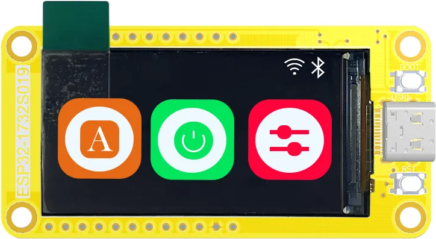
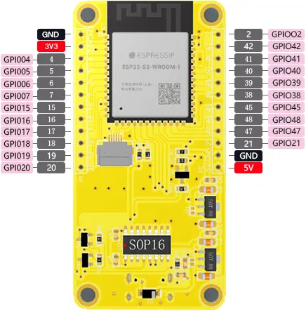

### ESP32-2424S012 N/C

- Round
- USB-C
- GC9A01
- CST816S
- Switch
- Serial + Power: SH1.0 4p
- Lithium Battery interface: JST 1.25 2p


### ESP32-2432S022 N/C

- USB-C
- ST7789
- CST816S
- TF card interface
- Power + Serial: JST1.25 4p
- Speaker: JST1.25 2p
- Battery interface JST 1.25 2p

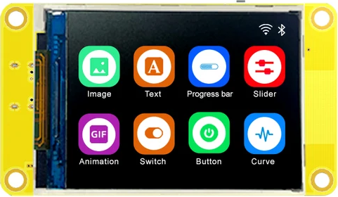
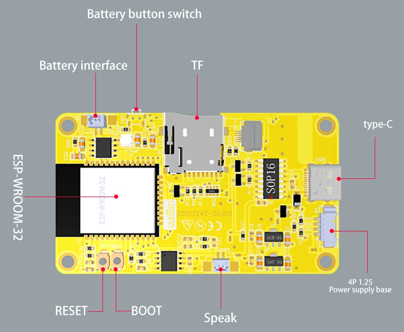

### ESP32-2432S024 N/R/C

- USB-C
- ILI9341
- XPT2046 / CST816S
- TF card interface
- I2C: 2 x JST1.0 4p
- Power + Serial: JST1.25 4p
- Speaker: JST1.25 2p
- Battery interface JST 1.25 2p

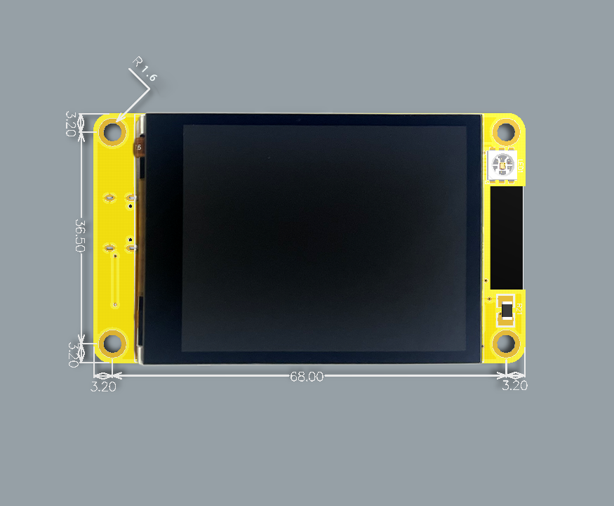

### ESP32-2432S028R

- Micro USB
- ILI9341
- XPT2046
- TF card interface
- I2C: 2 x JST1.0 4p
- Power + Serial: JST1.25 4p
- Speaker: JST1.25 2p
- Battery interface JST 1.25 2p

> [!NOTES]
> There is a special variant (USB-C connector) that has a different screen init sequence, the ESP32-2432S028Rv2.
> There are also clone boards with the marking 7789 on the box. This is the v3 variant that has a ST7789 controller instead of the ILI9341!


### ESP32-3248S032 N/R/C

- Micro USB
- ST7789
- XPT2046 / GT911
- TF card interface
- I2C: 2 x JST1.0 4p
- Power + Serial: JST 1.25 4p
- Speaker: JST1.25 2p
- Battery interface JST 1.25 2p

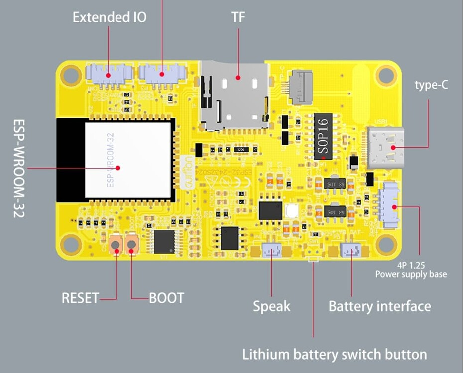

### ESP32-3248S035 R/C

- Micro USB
- ST7796
- XPT2046 / GT911
- TF card interface
- I2C: 2 x JST1.0 4p
- Power + Serial: JST1.25 4p
- Speaker: JST1.25 2p


### ESP32-4827S043 N/R/C

- USB-C
- ST7262 / 16 bit parallel interface
- GT911 / XPT2046
- TF card interface
- I2C: JST1.0 4p
- Power + Serial: JST1.25 4p

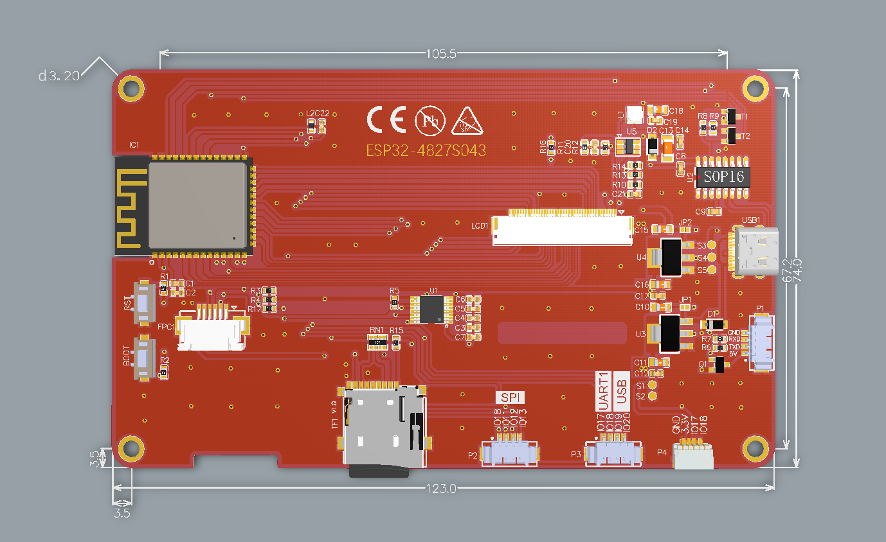
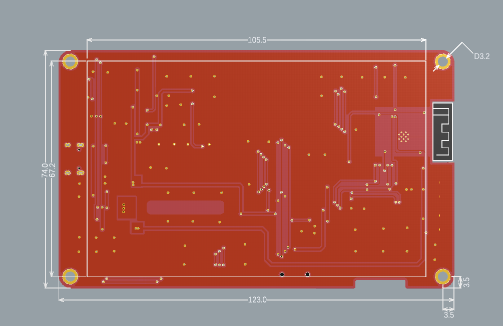

### ESP32-4848S040 C

- USB-C
- ST7701 / 16 bit parallel interface + 3 wire SPI
- GT911
- Two versions; with one or three relays
- 110V - 320V power supply build in!

> [!NOTES]
> The ESP32-4848S040C relays and I2S audio are shared IO ports (IO1, IO2, IO40).
> If audio is needed, the 0 ohm resistors R25, R26, and R27 should be moved to R21, R22, and R23

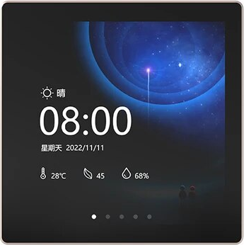
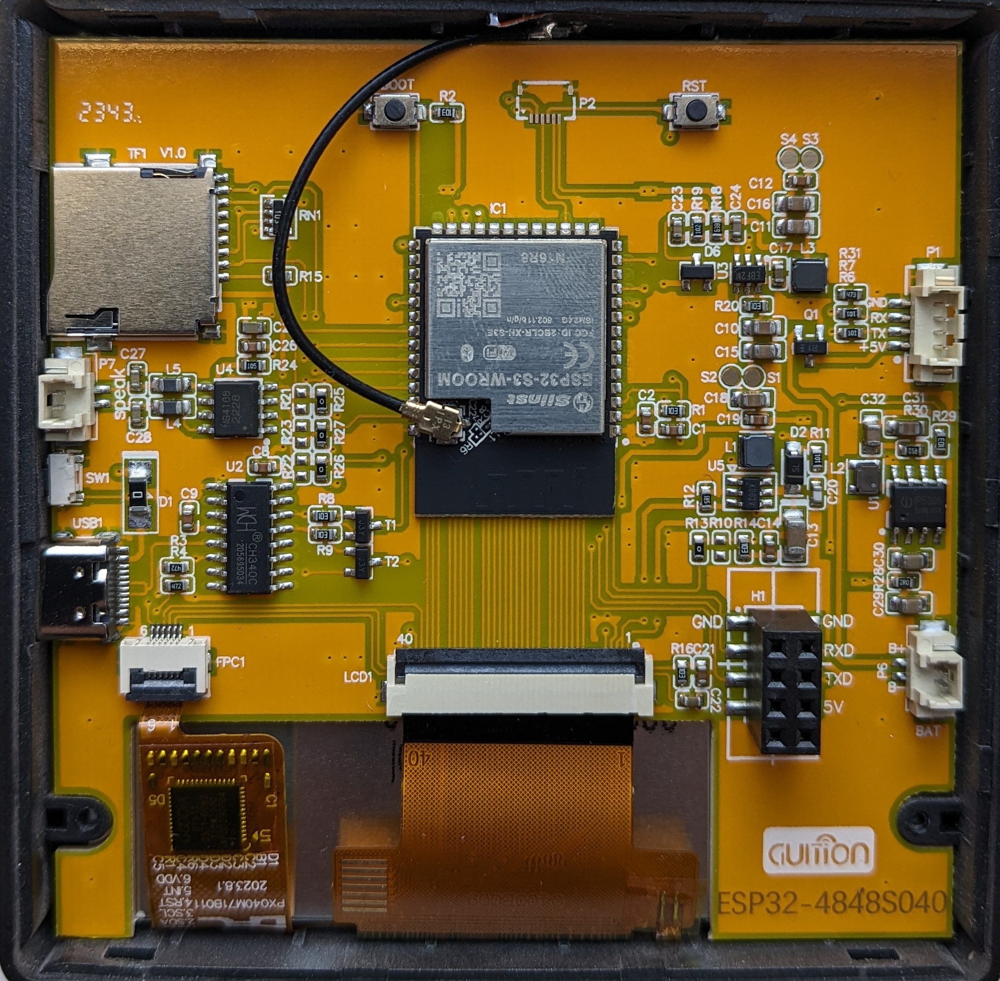

### ESP32-8048S050 N/R/C

- USB-C
- ST7262 / 16 bit parallel interface
- GT911
- TF card interface
- I2C: JST1.0 4p
- Power + Serial: JST1.25 4p


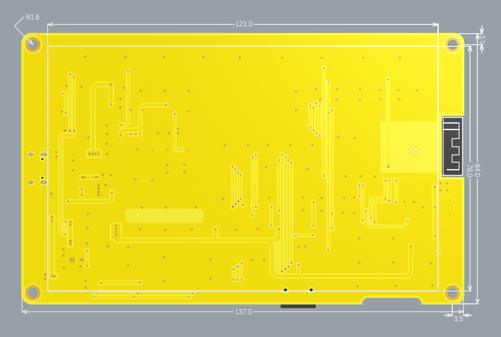

### ESP32-8048S070 N/R/C

- USB-C
- ST7262 / 16 bit parallel interface
- GT911 / XPT2046
- TF card interface
- I2C: JST1.0 4p
- Power + Serial: JST1.25 4p

>[!NOTES]
>There are different versions present with a difference in the mapping for the colors from the GPIOs to RGB.
>Known versions are 1.1 and 1.3.

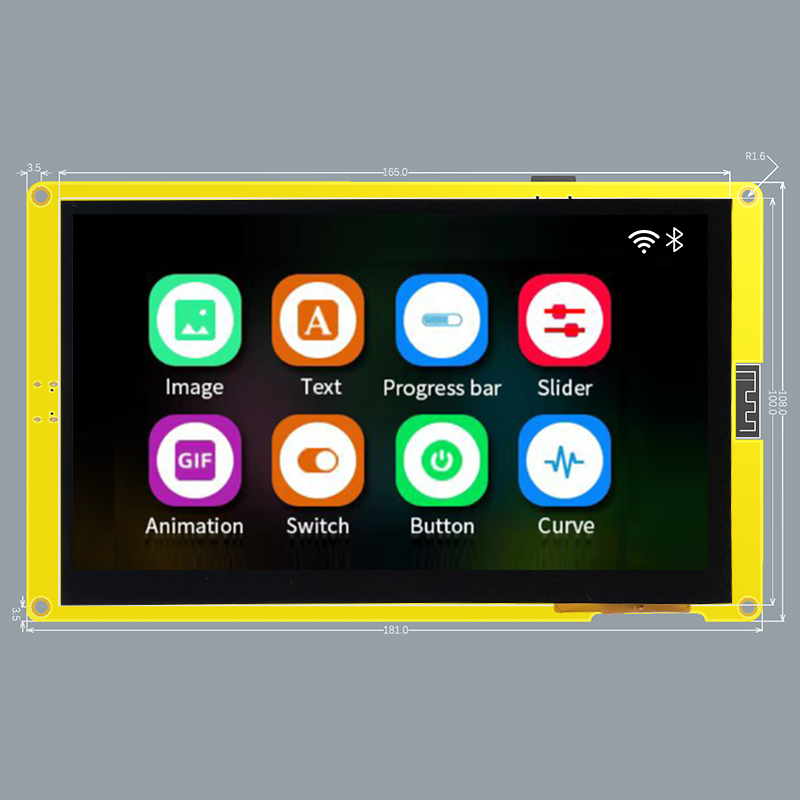
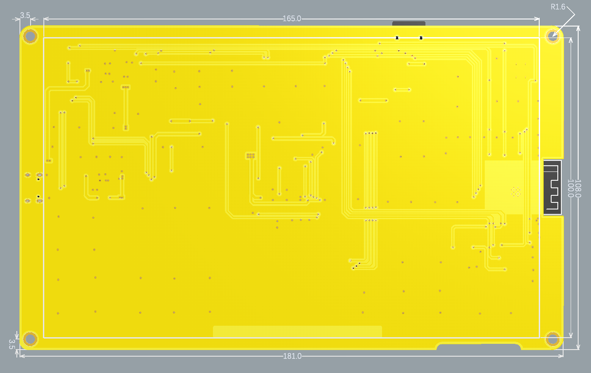
